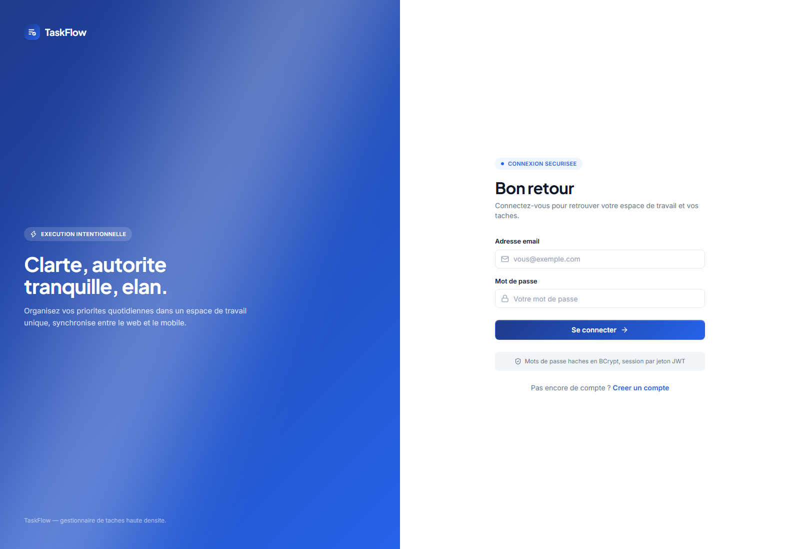
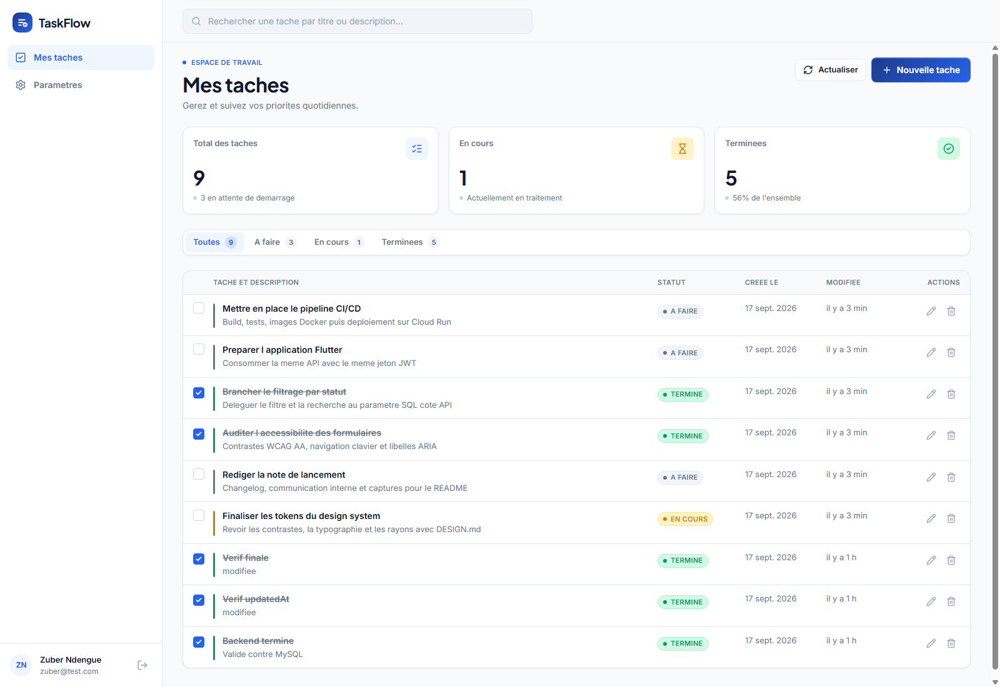
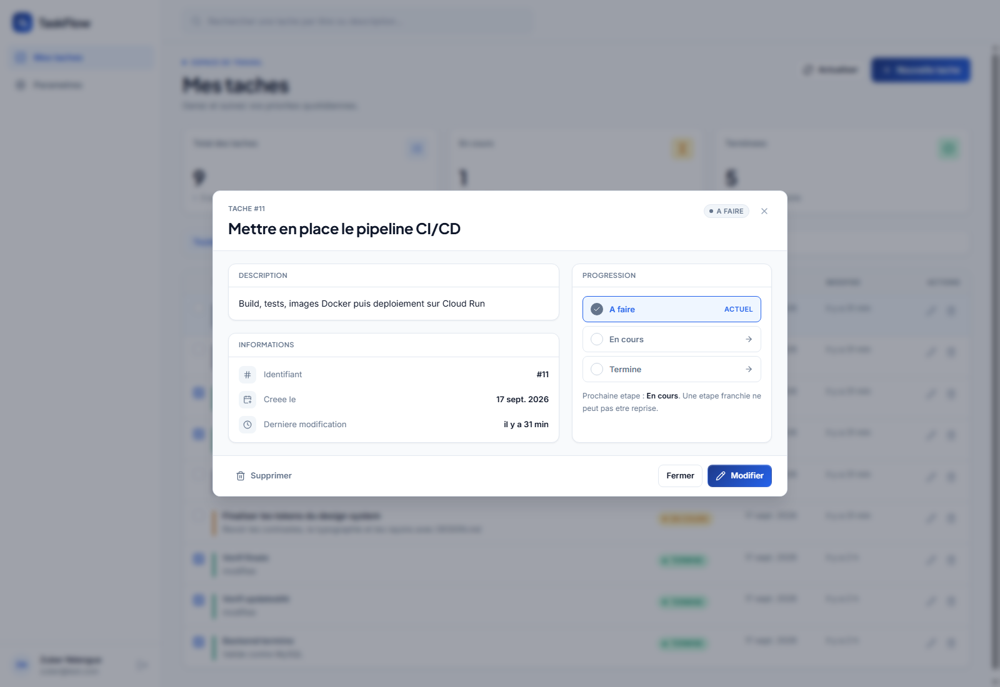
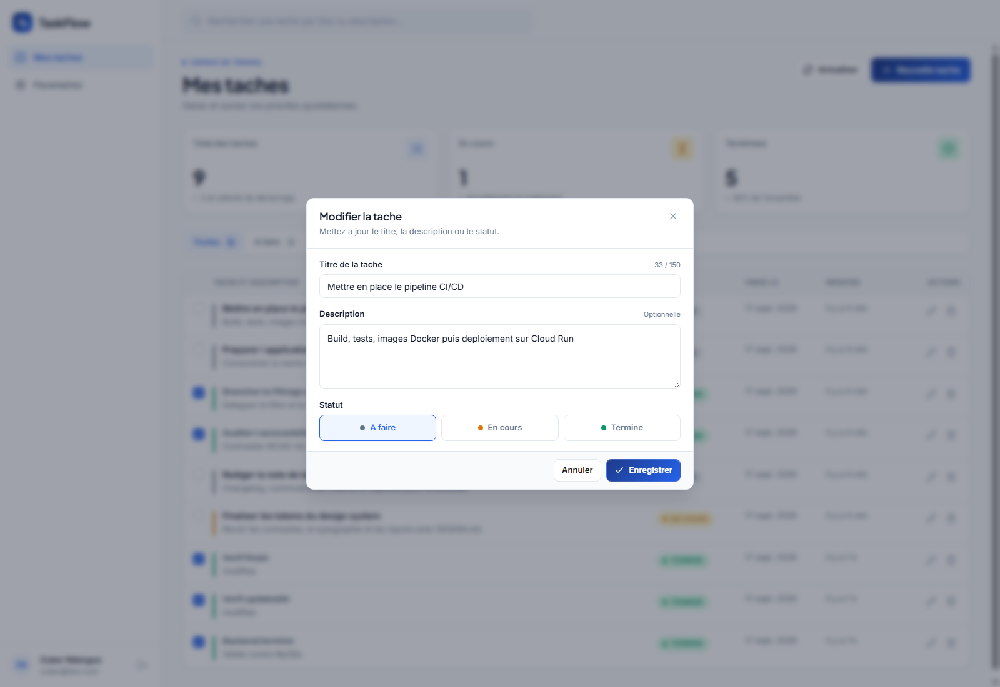

# Task Manager

Application de gestion de tâches en trois parties : une **API REST Java Spring Boot**,
un **frontend web React** et une **application mobile Flutter**, toutes trois branchées
sur la même base de données et le même système d'authentification.

Réalisé dans le cadre du test de recrutement décrit dans `TEST DE RECRUTEMENT.pdf`.

---

## Aperçu

| Connexion | Liste des tâches |
|---|---|
|  |  |

| Détail d'une tâche | Édition |
|---|---|
|  |  |

---

## Ce qui est livré

| Étape du sujet | État |
|---|---|
| **1. Backend Spring Boot** — API REST, JWT, MySQL | ✅ Terminée, 8 tests |
| **2. Frontend React + Vite + TypeScript** | ✅ Terminée |
| **3. Application mobile Flutter** *(bonus)* | ✅ Code terminé, 7 tests — non exécutée, voir *Limites* |
| **4. CI/CD et déploiement GCP** *(bonus)* | ❌ Non réalisée |

## Stack technique

| Couche | Technologies |
|---|---|
| Backend | Java 21, Spring Boot 3.5, Spring Security, Spring Data JPA, MySQL 8 |
| Authentification | JWT (JJWT), mots de passe hachés en BCrypt |
| Frontend web | React 19, Vite 8, TypeScript strict, Tailwind CSS v4, React Router 7 |
| Mobile | Flutter 3.38, Dart 3, `dio`, `shared_preferences` |
| Infrastructure | Docker Compose (MySQL + Adminer) |
| Tests | JUnit 5 + MockMvc (backend), `flutter_test` (mobile) |

## Organisation du dépôt

```
.
├── backend/     API REST Spring Boot
├── frontend/    Interface web React
├── mobile/      Application Flutter
├── docs/        Captures d'écran
└── DESIGN.md    Design system partagé par le web et le mobile
```

---

## Démarrage

### Prérequis

| Outil | Version | Nécessaire pour |
|---|---|---|
| JDK | 21 | backend |
| Maven | 3.9+ | backend |
| Docker | récent | base de données |
| Node.js | 20+ | frontend web |
| Flutter | 3.38+ | application mobile |

Docker suffit pour la base : **aucune installation de MySQL n'est requise.**

### 1. Lancer la base de données

```bash
cd backend
docker compose up -d
```

MySQL 8 démarre sur le port **3307** — volontairement pas 3306, pour ne pas
entrer en conflit avec une instance MySQL déjà installée sur la machine.
La base `taskmanager` et l'utilisateur `taskuser` sont créés automatiquement.

### 2. Lancer l'API

```bash
cd backend
mvn spring-boot:run
```

L'API écoute sur **http://localhost:8080**. Les tables sont créées au premier
démarrage par Hibernate — aucun script SQL à exécuter.

Aucun argument n'est nécessaire : le profil `docker` est actif par défaut, y
compris en lançant la classe `TaskManagerApplication` depuis un IDE.

### 3. Lancer le frontend web

```bash
cd frontend
npm install
npm run dev
```

L'interface est servie sur **http://localhost:5173**.

Créez un compte depuis l'écran d'inscription, et vous êtes connecté.

### 4. Lancer l'application mobile

```bash
cd mobile
flutter pub get
flutter run
```

Un émulateur Android ne voit pas le `localhost` de la machine hôte : l'application
bascule seule sur `http://10.0.2.2:8080`, qui en est l'alias. Pour un téléphone
physique sur le même réseau Wi-Fi :

```bash
flutter run --dart-define=API_BASE_URL=http://192.168.1.20:8080
```

### Consulter la base de données

Une interface web optionnelle est fournie :

```bash
cd backend
docker compose --profile tools up -d
```

Puis **http://localhost:8081** — serveur `mysql`, utilisateur `taskuser`,
mot de passe `taskpassword`, base `taskmanager`.

Elle ne démarre pas avec un `docker compose up` classique : c'est un outil de
confort, pas un composant de l'application.

---

## L'API

Toutes les routes sauf l'inscription et la connexion exigent l'en-tête
`Authorization: Bearer <token>`.

| Méthode | Route | Auth | Rôle |
|---|---|:---:|---|
| `POST` | `/api/auth/register` | — | Inscription. Renvoie `201` + jeton |
| `POST` | `/api/auth/login` | — | Connexion. Renvoie `200` + jeton |
| `GET` | `/api/auth/me` | 🔒 | Profil courant |
| `GET` | `/api/tasks` | 🔒 | Liste des tâches. Filtres `?status=` et `?search=` |
| `GET` | `/api/tasks/{id}` | 🔒 | Détail d'une tâche |
| `POST` | `/api/tasks` | 🔒 | Création. Renvoie `201` |
| `PUT` | `/api/tasks/{id}` | 🔒 | Modification |
| `DELETE` | `/api/tasks/{id}` | 🔒 | Suppression. Renvoie `204` |

### Exemple

```bash
# Inscription — le jeton est renvoyé directement
curl -X POST http://localhost:8080/api/auth/register \
  -H "Content-Type: application/json" \
  -d '{"name":"Zuber","email":"zuber@test.com","password":"password123"}'

# Création d'une tâche
curl -X POST http://localhost:8080/api/tasks \
  -H "Authorization: Bearer $TOKEN" \
  -H "Content-Type: application/json" \
  -d '{"title":"Finir le test","description":"Backend","status":"IN_PROGRESS"}'

# Filtrage et recherche combinés
curl "http://localhost:8080/api/tasks?status=DONE&search=test" \
  -H "Authorization: Bearer $TOKEN"
```

### Le statut ne recule jamais

Une tâche suit le cycle `TODO → IN_PROGRESS → DONE`. Avancer de plusieurs crans
d'un coup est permis — une tâche peut être terminée directement — mais **tout
retour en arrière est refusé** :

```
PUT /api/tasks/9  {"status":"TODO"}   sur une tâche déjà DONE
→ 409 Conflict   "Le statut ne peut pas revenir en arriere : DONE -> TODO"
```

La règle est portée par l'enum `TaskStatus` et appliquée dans `TaskService`,
donc **côté serveur**. Le web et le mobile la reflètent en grisant ce qui est
interdit, mais ne peuvent pas la contourner : un appel direct à l'API échoue
de la même manière.

### Format d'erreur

Toutes les erreurs, y compris les `401` émis par la couche sécurité, sortent
au même format. Les clients n'ont donc qu'un seul cas à traiter :

```json
{
  "timestamp": "2026-09-17T14:20:34Z",
  "status": 400,
  "error": "Bad Request",
  "message": "Donnees invalides",
  "path": "/api/tasks",
  "fieldErrors": { "title": "Le titre est obligatoire" }
}
```

`fieldErrors` permet d'afficher chaque message sous le champ concerné plutôt
que dans une alerte générique.

---

## Architecture

### Backend — `backend/`

```
controller/   couche HTTP : validation des entrées, codes de retour
service/      règles métier et transactions
repository/   accès aux données (Spring Data JPA)
entity/       modèle persistant : User, Task
dto/          contrats d'API (records) — les entités ne sortent jamais telles quelles
security/     génération et validation des JWT, filtre d'authentification
config/       sécurité HTTP, CORS, BCrypt
exception/    traduction des erreurs en JSON homogène
```

### Frontend web — `frontend/`

```
src/
├── types/        miroir des DTO de l'API
├── lib/          client fetch, règles de statut, helpers
├── context/      AuthProvider, ToastProvider
├── hooks/        useAuth, useTasks, useToast, useDebounced
├── components/   ui/ (Button, Input, Modal…), layout/, tasks/
└── pages/        Login, Register, Tasks, Settings
```

### Mobile — `mobile/`

```
lib/
├── core/       tokens de design, thème, adresse de l'API, erreurs
├── models/     Task, User, TaskStatus
├── services/   client dio, stockage du jeton, appels auth et tâches
├── state/      AuthController, TaskController
├── screens/    connexion, inscription, liste, détail, formulaire
└── widgets/    logo, pastille de statut, carte de tâche
```

---

## Choix techniques

Cette section explique les décisions qui ne se devinent pas à la lecture du code.

### Sécurité

**Les tâches sont cloisonnées par utilisateur.** Toute lecture ou écriture passe
par `findByIdAndUserId`. Un utilisateur qui tente d'accéder à la tâche d'un autre
reçoit `404` et non `403` : on ne révèle pas l'existence d'une ressource qui ne
lui appartient pas. Un test couvre ce cas.

**Les DTO ne laissent pas fuir le modèle.** Les entités ne sont jamais sérialisées
directement, ce qui rend impossible l'apparition accidentelle du hash du mot de
passe dans une réponse, et garde le contrat d'API stable si le modèle évolue.

**Sessions sans état.** Aucune session serveur, tout tient dans le JWT. C'est ce
qui permet à la fois le déploiement multi-instance et le partage du même
mécanisme d'authentification entre le web et le mobile.

**Aucun secret en dur.** Toute la configuration sensible passe par variables
d'environnement, avec des valeurs de développement par défaut.

### Performance et justesse

**Filtrage et recherche exécutés en SQL.** Les onglets de statut et la barre de
recherche déclenchent un appel à l'API avec `?status=` et `?search=` plutôt que
de filtrer un tableau déjà chargé. C'est le comportement correct dès que le
volume dépasse ce qu'on veut transférer d'un coup.

**Protection contre les réponses hors séquence.** Le web comme le mobile
incrémentent un identifiant de requête et ignorent toute réponse qui n'est pas
la plus récente. Sans cela, une réponse lente pour « ba » pourrait écraser le
résultat déjà affiché pour « backend ».

**Recherche débouncée** à 350 ms, pour ne pas déclencher un appel par frappe.

### Expérience utilisateur

**Le jeton est revalidé, jamais présumé valide.** Sa présence en stockage local
ne prouve rien : il peut être expiré. Au démarrage, les deux clients appellent
`/api/auth/me` et affichent un état de chargement pendant ce temps, plutôt que
de faire clignoter l'écran de connexion à chaque rafraîchissement.

**Un `401` purge la session, où qu'il survienne.** Le client HTTP expose un
gestionnaire global : n'importe quel appel recevant un `401` efface le jeton et
ramène à la connexion, sans avoir à traiter ce cas dans chaque écran.

**Aucune donnée fictive.** Les indicateurs du tableau de bord sont calculés à
partir des tâches réellement chargées. Les champs que l'API n'expose pas ne sont
pas affichés plutôt que simulés.

### Cohérence visuelle

`DESIGN.md` définit un design system complet : palette, échelles typographiques,
rayons, quatre niveaux d'élévation, spécifications de composants.

Ses tokens sont déclarés **une seule fois par plateforme** — dans `@theme` de
Tailwind côté web, dans `lib/core/design.dart` côté mobile. Conséquence
volontaire : aucune valeur brute comme `#2563eb` n'apparaît dans un composant,
et changer une couleur du thème se fait à un seul endroit. Les deux applications
partagent ainsi la même identité.

---

## Tests

```bash
cd backend   && mvn test        # 8 tests
cd mobile    && flutter test    # 7 tests
cd frontend  && npm run build   # vérification TypeScript stricte
```

Les tests du backend tournent sur **H2 en mémoire** : aucune base MySQL n'est
nécessaire, ce qui les rend exécutables tels quels dans une chaîne d'intégration.

Ce qu'ils couvrent :

| Test | Vérifie |
|---|---|
| Cycle de vie complet d'une tâche | Création, modification, filtrage, suppression |
| Accès sans jeton | Renvoie `401` |
| Validation d'un email invalide | Renvoie `400` avec `fieldErrors` |
| Cloisonnement entre deux utilisateurs | Les tâches d'autrui sont invisibles |
| `updatedAt` après modification | La réponse porte la date réelle, pas celle de création |
| Retour en arrière du statut | Refusé par un `409` |
| Progression vers l'avant | Autorisée |
| Édition d'une tâche terminée | Renvoyer le même statut n'est pas un recul |

## Configuration

Toutes les variables ont une valeur de développement par défaut. Un fichier
`.env.example` est fourni dans `backend/` et `frontend/`.

| Variable | Défaut | Rôle |
|---|---|---|
| `SPRING_PROFILES_ACTIVE` | `docker` | `docker` (port 3307), `local` (3306), ou aucun en production |
| `DB_HOST` / `DB_PORT` | `localhost` / `3306` | Serveur MySQL |
| `DB_USERNAME` / `DB_PASSWORD` | `root` / *(vide)* | Identifiants |
| `JWT_SECRET` | valeur de dev | Clé HMAC, **32 caractères minimum** |
| `JWT_EXPIRATION_MS` | `86400000` | Durée de validité du jeton (24 h) |
| `CORS_ALLOWED_ORIGINS` | `http://localhost:5173` | Origines autorisées |
| `VITE_API_TARGET` | `http://localhost:8080` | API visée par le proxy de développement |
| `API_BASE_URL` | selon la cible | Adresse de l'API côté mobile |

> **En production**, `JWT_SECRET` doit impérativement être fourni par
> l'environnement. La valeur par défaut est publique, elle n'existe que pour
> permettre un premier lancement sans configuration.

---

## Limites connues

Par honnêteté envers celui qui évalue, voici ce qui n'est pas acquis :

**L'application mobile n'a jamais été exécutée.** Le code compile, `flutter
analyze` ne signale rien et les 7 tests unitaires passent, mais le build Android
échoue au téléchargement des artefacts Gradle — un problème de réseau sur la
machine de développement, pas de code. Le cycle connexion / liste / CRUD n'a donc
pas été observé à l'écran sur mobile. Il l'a été sur le web, contre une vraie
base MySQL.

**L'étape 4 n'est pas faite.** Pas de pipeline CI/CD ni de déploiement GCP.
Le `docker-compose.yml` existe et les tests tournent sans base externe, ce qui
constitue les prérequis, mais le pipeline reste à écrire.

**La cible web de Flutter échouerait sur CORS.** Elle a été incluse pour
faciliter les tests, mais un navigateur enverrait une origine que l'API
n'autorise pas. Sur Android et iOS, il n'y a aucun contrôle CORS : c'est sans
effet sur la cible réelle du sujet.

**Le modèle de tâche est volontairement limité** à ce que définit le sujet :
`title`, `description`, `status`, `createdAt`, `updatedAt`. Priorité, échéance
et assignation n'ont pas été ajoutées pour ne pas afficher des champs sans
données réelles derrière.

**L'interface est rédigée sans accents.** Un détail de forme, corrigeable d'un
seul passage, qui n'affecte pas le fonctionnement.

---

## Auteur

**Zuber Ndengue** — test de recrutement, septembre 2026.
